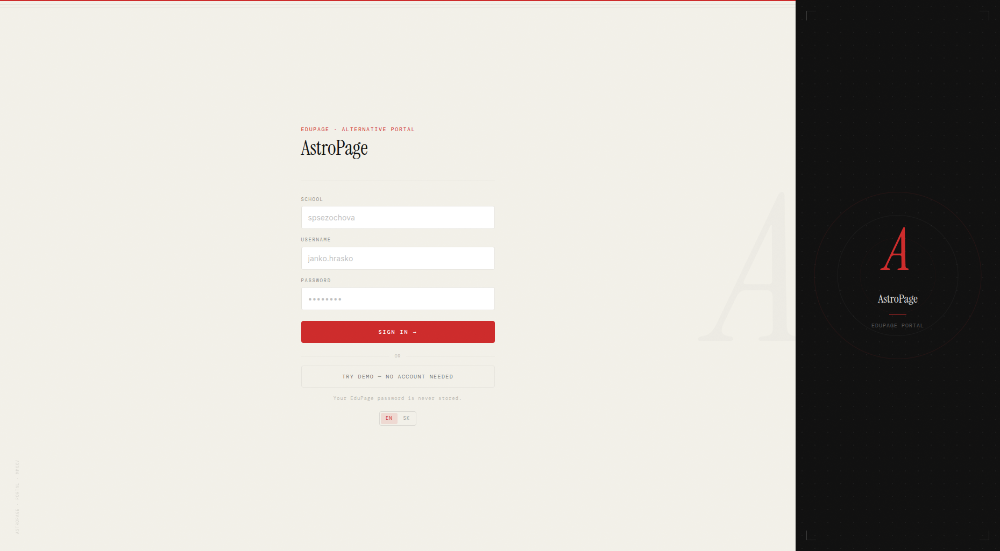
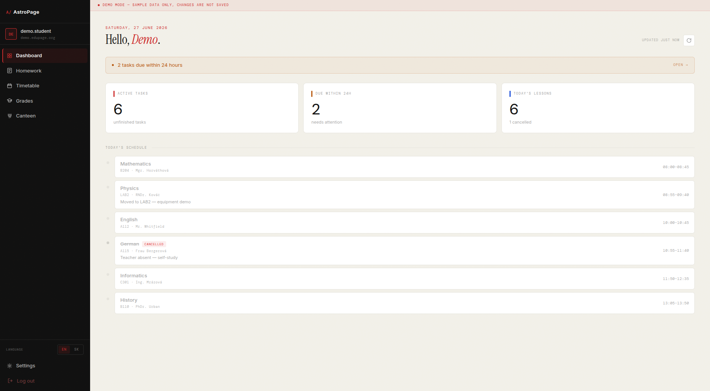
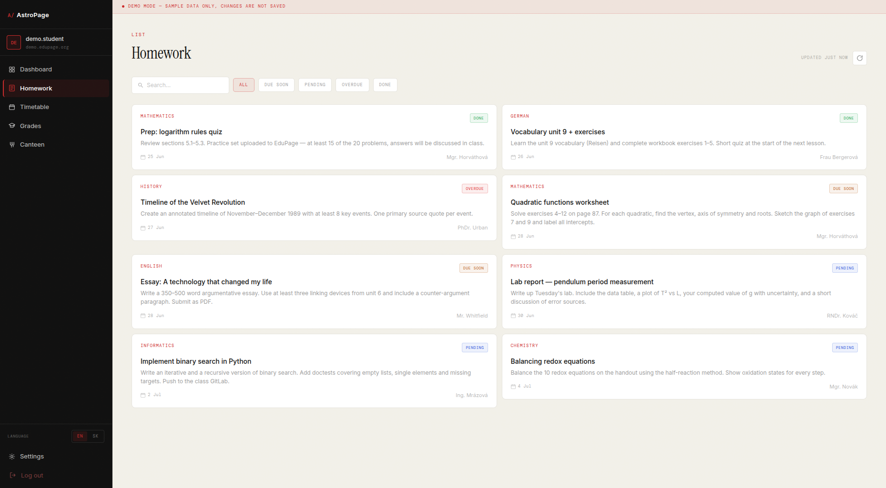
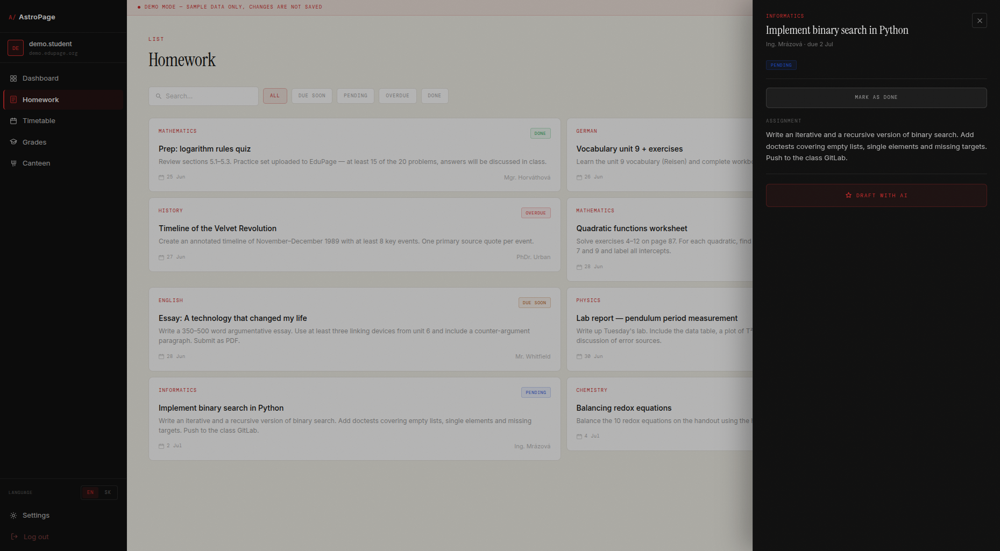
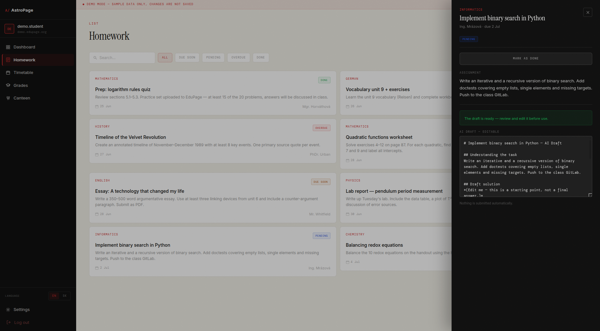
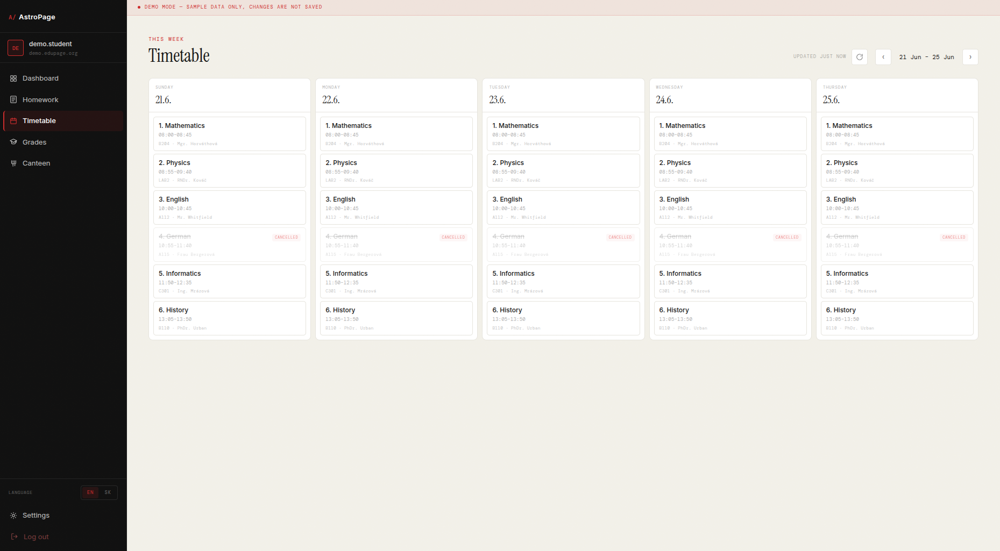
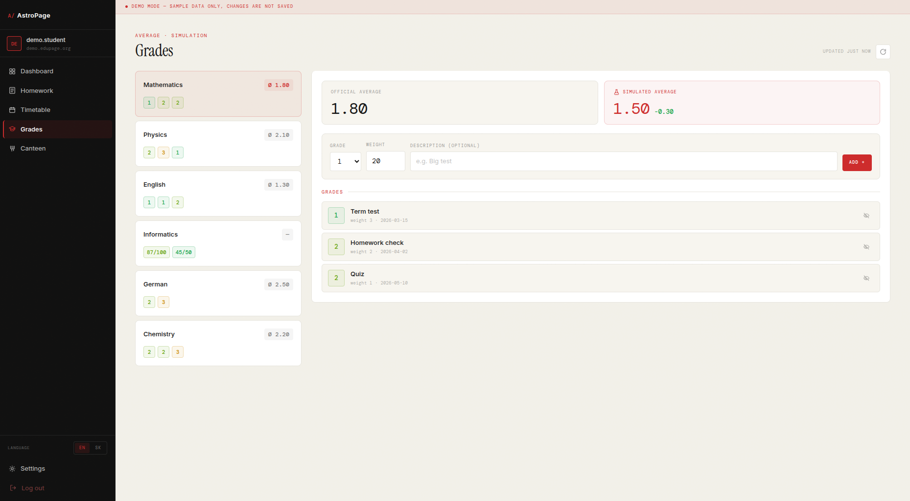
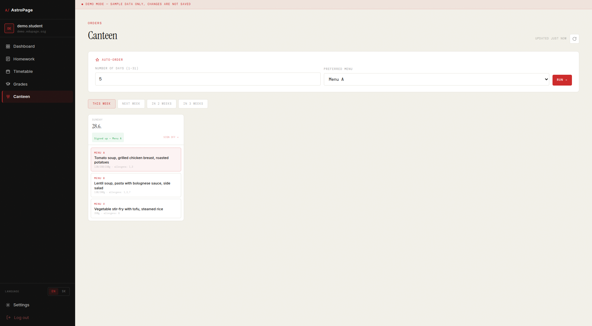

# AstroPage

A modern alternative portal for EduPage — the school management platform used by thousands of schools across Central and Eastern Europe. AstroPage replaces EduPage's rigid default UI with a fast, clean React dashboard and adds an AI homework assistant powered by Google Gemini.

---

## Trying the app

### Option A — Demo mode (no account needed)

You do not need an EduPage account to explore the app. On the login screen, click **"Try demo — no account needed"**. You will be taken straight into a fully functional dashboard loaded with realistic sample data: assignments, a timetable, grades, canteen meals, and a working AI homework draft generator.



Everything works in demo mode — filters, the what-if grade simulator, meal ordering, the AI draft button — but no real data is sent or received. A red banner at the top of every page labels the session as demo mode so the distinction is clear.

### Option B — Real EduPage login

If you have an EduPage school account, you can log in with your actual data.

**What you need:**
- Your school's EduPage subdomain (e.g. `spsezoska` — the part before `.edupage.org`)
- Your EduPage username (usually `firstname.lastname`)
- Your EduPage password

**Steps:**
1. Open the app.
2. Enter your subdomain in the **School** field.
3. Enter your username and password.
4. Click **Sign in**.

The backend authenticates directly against your school's EduPage instance. Your password is never stored anywhere — not in memory beyond a single request, not in the database, not in logs. After authentication, an encrypted session token is stored server-side and a JWT is issued in an `HttpOnly` cookie. Your password is discarded immediately.

> **Note:** You can only log in if your school uses EduPage. If your school subdomain does not exist or your credentials are wrong, you will see an error message.

---

## What each page does

### Dashboard



The landing page after login. Shows:
- **Active tasks** — total number of homework assignments not yet marked as done.
- **Due within 24 h** — urgent assignments; clicking the banner navigates directly to the homework list.
- **Today's lessons** — count and how many are cancelled.
- **Today's schedule** — a timeline of every period with room, teacher, cancellation status, and curriculum notes. The current lesson is highlighted in real time.

### Homework



A list of all your assignments. Features:
- **Filter bar** — filter by status: All / Due soon / Pending / Overdue / Done.
- **Search** — search by assignment title, subject, or teacher name.
- **Status badges** — colour-coded: green (done), amber (due soon), red (overdue), blue (pending).
- **Assignment drawer** — click any card to open a detail panel on the right.



Inside the drawer:
- Full assignment description.
- Attachments (PDF, images) if the teacher uploaded any.
- **Mark as done / undone** toggle — syncs back to EduPage.
- **Draft with AI** button — sends the assignment to Google Gemini and returns a structured, editable draft.



The AI draft appears in an editable text area. The model is constrained to always explain its reasoning — it will not just produce a bare answer. **Nothing is ever submitted automatically.** You edit the draft, copy it, and submit it yourself through EduPage as normal.

### Timetable



A weekly grid showing all five school days side by side. Features:
- **Week navigation** — arrows to step forward and back one week at a time.
- **Cancellations** — struck-through lessons with a red "CANCELLED" badge.
- **Curriculum notes** — short notes from the teacher (e.g. "Moved to LAB2 — equipment demo").
- **Current lesson highlight** — the period currently in progress is highlighted in red.

### Grades



All your subjects in one view. Features:
- **Official average** — the weighted average EduPage has on file.
- **What-if simulator** — add a hypothetical future grade and see how it changes your average in real time. You can also hide any existing grade to simulate dropping it.
- **Points-based grades** — subjects where grades are points (e.g. `87/100`) are displayed differently from the standard 1–5 Slovak scale.
- Grades are colour-coded: green (1) through red (5).

### Canteen



Meal ordering for your school canteen. Features:
- **Week tabs** — view and order meals for this week, next week, and the following two weeks.
- **Menu options** — each day shows available menus (A, B, vegetarian) with dish names, allergens, and weights.
- **One-click ordering** — click a menu option to order it; click the active option again to sign off.
- **Auto-order** — set a preferred menu letter and a number of days; the backend signs you up for all upcoming unordered days in one request.
- Changes are confirmed by reading the state back from EduPage — a 200 OK is not trusted blindly.

### Settings

Lets you customise how the AI homework assistant behaves for your account:
- **Custom system prompt** — prepended to every Gemini request so the model knows your preferences (language, style, depth).
- **Toggles** — step-by-step mode, simple language, citation requirements.

---

## Stack

| Layer | Tech |
|---|---|
| Frontend | React 19 + Vite + TypeScript + Tailwind CSS |
| Backend | FastAPI (Python 3.11+, async throughout) |
| EduPage integration | `edupage-api` Python module |
| AI assistant | Google Gemini (`gemini-2.5-flash`) |
| Database | Postgres via async SQLAlchemy + SQLModel |
| Auth | JWT in `HttpOnly` cookie + Fernet-encrypted server-side session |
| i18n | Custom React context — English (default) + Slovak |

---

## Architecture

### Auth and sessions

The app never stores your password. When you log in:
1. The backend calls `edupage-api` with your credentials against your school's subdomain.
2. On success, EduPage returns a session cookie. The backend Fernet-encrypts it and stores it in Postgres.
3. A JWT is issued in an `HttpOnly` cookie (not readable by JavaScript). Your password is discarded.
4. On every subsequent request, the JWT is verified and the EduPage session is decrypted and rehydrated from Postgres.

### Frontend caching

Every data page uses `useCachedResource` — a hook that:
- Seeds component state synchronously from an in-memory session cache (no loading flash on cache hit).
- Refetches in the background when the TTL expires while the page is open.
- Refreshes when the browser tab regains focus with stale data.
- Exposes a manual `refresh()` button.

On login, `prefetchAll()` fires in the background and warms every page's cache sequentially (dashboard first), so the first tab switch after login is typically instant.

### AI homework pipeline

1. Student opens an assignment and clicks "Draft with AI".
2. Backend fetches the full assignment text and up to 5 attachments (PDFs, images) from EduPage.
3. All content is sent to Gemini as inline parts (text/PDF/image, ≤ 20 MB each), along with the student's custom system prompt from Settings.
4. A `STUDY_ASSISTANT_CONSTRAINT` is always appended: the model must draft *and explain*, never produce a bare answer.
5. The draft is returned as editable text. Nothing is submitted automatically.

### Internationalisation

- Language is selected on the login screen and persisted in `localStorage`.
- All UI strings live in `frontend/src/i18n/translations.ts` as a flat EN/SK catalogue.
- Date and number formatting uses `Intl` with `en-GB` or `sk-SK` locale.
- `tn(key, n)` handles plural forms; Slovak uses a 3-form system (one/few/other).

---

## Project structure

```
AstroPage/
├── backend/               # FastAPI app
│   ├── app/
│   │   ├── main.py
│   │   ├── api/v1/        # versioned endpoints
│   │   ├── core/          # config, logging, security
│   │   ├── models/        # domain models
│   │   ├── schemas/       # Pydantic I/O schemas
│   │   └── services/      # business logic (edupage, ai, timetable, …)
│   ├── scripts/           # PoC scripts used during EduPage reverse-engineering
│   ├── tests/
│   ├── pyproject.toml
│   └── .env.example
├── frontend/              # React + Vite SPA
│   └── src/
│       ├── api/           # client, cache, prefetch, useCachedResource
│       ├── components/    # AppLayout, RefreshButton, LanguageSwitcher
│       ├── context/       # AuthContext (incl. demo mode)
│       ├── data/          # mock data for demo mode
│       ├── i18n/          # LanguageContext, translations
│       └── pages/         # Dashboard, Homework, Timetable, Grades, Canteen, Settings, Login
├── docs/screenshots/      # UI screenshots
├── .github/workflows/     # CI (lint+test) + CD (self-hosted runner → home server)
├── docker-compose.yml
└── Makefile
```

---

## Getting started

**Prerequisites:** Python 3.11+, [`uv`](https://github.com/astral-sh/uv), Node.js 20+

```bash
# Install all dependencies
make install

# Copy and fill in environment variables
cp backend/.env.example backend/.env
# Edit backend/.env — at minimum set DATABASE_URL
```

Start Postgres (the backend requires it for session storage):

```bash
docker compose up -d db
```

Then run backend and frontend in two separate terminals:

```bash
make dev-backend    # FastAPI on http://localhost:8000
make dev-frontend   # Vite on http://localhost:5173 (proxies /api → :8000)
```

Open `http://localhost:5173`. Use the **"Try demo"** button to explore without any EduPage account, or log in with your real credentials.

API docs (interactive): `http://localhost:8000/docs`

---

## Environment variables

See `backend/.env.example` for all variables and their defaults.

| Variable | Required | Description |
|---|---|---|
| `APP_ENV` | no | `development` (default) or `production` |
| `SECRET_KEY` | prod | HMAC signing key for tokens |
| `DATABASE_URL` | yes | Async Postgres URL; defaults match the `db` compose service |
| `JWT_SECRET` | prod | Signs session JWTs issued to the browser |
| `FERNET_KEY` | prod | Encrypts EduPage session cookies at rest; auto-derived from `SECRET_KEY` if unset |
| `FRONTEND_ORIGIN` | no | CORS-allowed origin (default `http://localhost:5173`) |
| `GEMINI_API_KEY` | AI only | Required for live AI homework drafts; demo mode does not use it |

---

## Docker

```bash
make docker    # builds and starts db + backend + frontend via Docker Compose
```

---

## Deployment

CD is via a self-hosted GitHub Actions runner on a home server. Pushing to `main` triggers the runner to sync the persistent clone and run `docker compose up -d --build`. There is no container registry and no inbound firewall rules — the runner polls GitHub outbound. See `.github/workflows/cd.yml` for details.

---

## Commands

```bash
make install        # install backend + frontend deps
make dev-backend    # start FastAPI with live reload
make dev-frontend   # start Vite dev server
make test           # run backend pytest suite
make lint           # ruff + eslint
make format         # ruff format
make docker         # full stack via Docker Compose
make clean          # remove build artifacts
```

---

## AI Declaration

I built this project using **Claude Code** (Anthropic's AI coding CLI) as a development tool. The distinction I care about: Claude wrote code I understood and directed; it did not make product or architecture decisions for me.

### What I personally did

**EduPage reverse-engineering.** The `edupage-api` Python library has incomplete docs and inconsistent field names. I wrote throwaway PoC scripts in `backend/scripts/` to probe what each library call actually returns — what fields come back, what's null, when it throws. That ground-level understanding shaped every endpoint I designed.

**Architecture decisions.** The core constraints are mine:
- No password storage: the backend authenticates against EduPage, Fernet-encrypts the session cookie, and discards the password immediately. I chose this because I don't want to be an identity provider.
- Per-subdomain session isolation: each school is a separate EduPage tenant; sessions cannot bleed across.
- Human-in-the-loop AI: the draft is always rendered editable. The student owns the final submission. This is a product decision, not a safety filter.
- Async throughout: EduPage fetches are network I/O; blocking calls are wrapped with `asyncio.to_thread`.

**Debugging and deployment.** I debugged the Docker CI/CD pipeline myself: the health-check failures (switched from `curl` to Python's `urllib` because `curl` wasn't in the image), the self-hosted GitHub Actions runner setup, and container networking. The runner polls GitHub outbound — no inbound ports needed.

**Frontend caching strategy.** The `useCachedResource` hook design (synchronous seed from cache, background refetch, tab-focus refresh, prefetch on login) was my design; Claude implemented the hook from the spec.

**Demo mode.** The logic to intercept all API calls in demo mode and return realistic mock data — including a working AI draft that generates structured study content — was something I added specifically so reviewers without EduPage accounts can explore the full feature set.

### What Claude Code handled

- FastAPI endpoint boilerplate, Pydantic schemas, SQLModel models once the shape was decided.
- React component markup and inline-style patterns, which I reviewed and refined.
- CI/CD YAML, Makefile targets, test stubs.
- Git commits and README text.

### In-app AI feature

The homework draft assistant uses **Google Gemini** (`gemini-2.5-flash`) at runtime. This is a separate product from Claude Code (which is a development CLI I used to write code faster). The backend always appends a study-assistant constraint: Gemini must draft *and explain*, never just produce a bare answer. The demo mode shows this flow with a local mock so you can see it work without a Gemini API key.

---

## Core constraints

These apply everywhere in this codebase and must never be violated:

- **Never store user passwords** — not in memory beyond a request, not in the DB, not in logs.
- **Never auto-submit to EduPage** — the human-in-the-loop review step is a product constraint, not a safety filter.
- **AI response is always a draft** — rendered editable in the UI; the student owns the final submission.
- **Treat `edupage-api` as a flaky scraper** — wrap every call in `asyncio.to_thread`, map exceptions to clean error responses, and verify every write by reading it back (EduPage returns 200 for no-ops).
